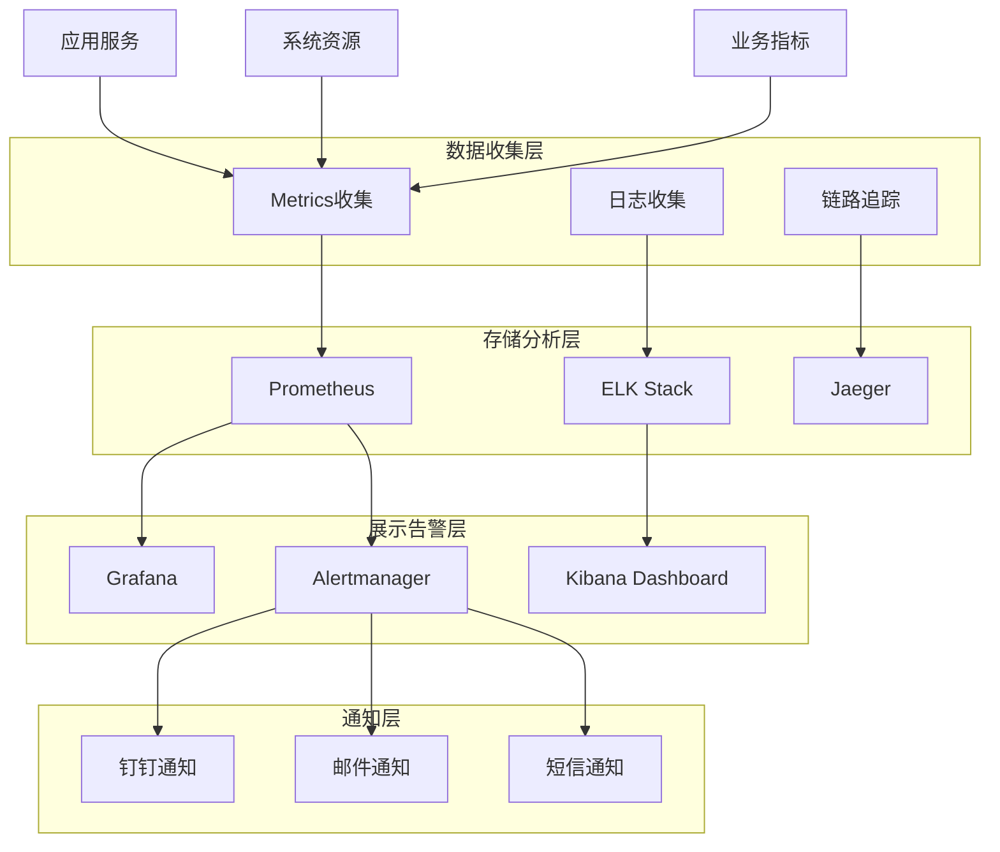
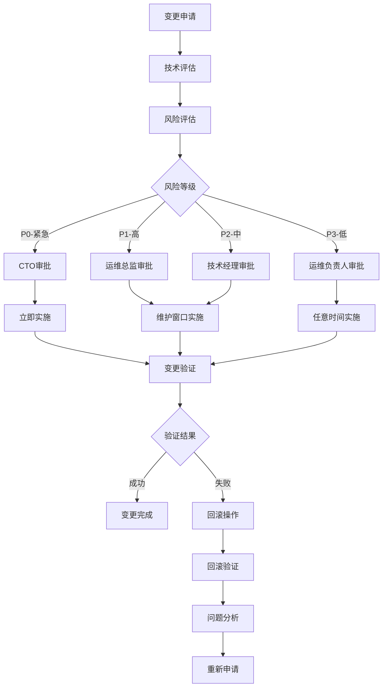

# 3PL货源沉淀工作台 - 运维保障体系建设方案

## 🎯 运维体系建设目标

### 总体目标
构建一套完整的运维保障体系，确保"3PL货源沉淀工作台"持续稳定运行，实现：
- **系统可用性**: ≥99.9%
- **故障恢复时间**: ≤15分钟
- **数据备份恢复**: RPO≤1小时，RTO≤30分钟
- **安全事件响应**: ≤30分钟

### 运维原则
1. **预防为主**: 通过监控预警提前发现问题
2. **自动化**: 减少人工操作，降低人为错误
3. **标准化**: 统一运维流程和操作规范
4. **可视化**: 运维数据透明化，便于决策
5. **持续改进**: 基于数据驱动优化运维策略

---

## 📊 监控告警体系

### 2.1 监控架构设计



### 2.2 监控指标体系

#### 2.2.1 业务指标监控

| 指标类别 | 指标名称 | 采集频率 | 告警阈值 | 说明 |
|---------|---------|---------|---------|------|
| 货源处理 | 创建成功率 | 1分钟 | <95% | 货源创建成功数量/总创建数量 |
| 货源处理 | 平均处理时间 | 1分钟 | >30s | 从创建到完成沉淀的平均时间 |
| 飞书同步 | 同步成功率 | 1分钟 | <98% | 飞书同步成功数量/总同步数量 |
| 飞书同步 | 同步延迟 | 1分钟 | >5s | 数据变更到同步完成的时间差 |
| 用户行为 | 活跃用户数 | 5分钟 | <10 | 过去5分钟有操作的用户数量 |
| 用户行为 | 操作错误率 | 1分钟 | >5% | 用户操作失败数量/总操作数量 |

#### 2.2.2 技术指标监控

| 指标类别 | 指标名称 | 采集频率 | 告警阈值 | 说明 |
|---------|---------|---------|---------|------|
| API性能 | 响应时间P95 | 1分钟 | >1000ms | 95%的API请求响应时间 |
| API性能 | 错误率 | 1分钟 | >2% | HTTP 4xx/5xx错误占比 |
| API性能 | 吞吐量 | 1分钟 | - | 每分钟API请求数量 |
| 数据库 | 连接数 | 30秒 | >80% | 数据库连接池使用率 |
| 数据库 | 慢查询数量 | 1分钟 | >10 | 执行时间>1秒的查询数量 |
| 数据库 | 锁等待时间 | 1分钟 | >500ms | 平均锁等待时间 |
| 缓存 | 命中率 | 1分钟 | <80% | Redis缓存命中比例 |
| 缓存 | 内存使用率 | 1分钟 | >90% | Redis内存使用比例 |
| 系统资源 | CPU使用率 | 30秒 | >80% | 服务器CPU使用比例 |
| 系统资源 | 内存使用率 | 30秒 | >85% | 服务器内存使用比例 |
| 系统资源 | 磁盘使用率 | 5分钟 | >85% | 服务器磁盘使用比例 |

### 2.3 告警规则配置

#### 2.3.1 业务告警规则

```yaml
# business_alerts.yml
groups:
- name: business_alerts
  rules:
  - alert: CargoProcessingFailure
    expr: |
      (
        rate(cargo_created_total[5m]) - 
        rate(cargo_created_success_total[5m])
      ) / rate(cargo_created_total[5m]) > 0.05
    for: 2m
    labels:
      severity: critical
      team: business
    annotations:
      summary: "货源创建失败率过高"
      description: "过去5分钟货源创建失败率{{ $value | humanizePercentage }}，超过5%阈值"
      runbook_url: "https://wiki.company.com/runbooks/cargo-processing-failure"

  - alert: FeishuSyncDelay
    expr: |
      histogram_quantile(0.95, 
        rate(feishu_sync_duration_seconds_bucket[5m])
      ) > 5
    for: 5m
    labels:
      severity: warning
      team: integration
    annotations:
      summary: "飞书同步延迟过高"
      description: "飞书同步P95延迟{{ $value }}s，超过5秒阈值"

  - alert: LowUserActivity
    expr: |
      active_users_5m < 5
    for: 10m
    labels:
      severity: info
      team: business
    annotations:
      summary: "用户活跃度较低"
      description: "过去5分钟活跃用户{{ $value }}人，低于预期"
```

#### 2.3.2 技术告警规则

```yaml
# technical_alerts.yml
groups:
- name: technical_alerts
  rules:
  - alert: HighErrorRate
    expr: |
      rate(http_requests_total{status=~"5.."}[5m]) / 
      rate(http_requests_total[5m]) > 0.02
    for: 2m
    labels:
      severity: critical
      team: backend
    annotations:
      summary: "HTTP错误率过高"
      description: "HTTP 5xx错误率{{ $value | humanizePercentage }}"

  - alert: SlowQueries
    expr: |
      increase(pg_stat_statements_total_time_seconds[5m]) > 10
    for: 5m
    labels:
      severity: warning
      team: database
    annotations:
      summary: "数据库慢查询"
      description: "过去5分钟慢查询总时间{{ $value }}秒"

  - alert: HighCPUUsage
    expr: |
      100 - (avg by (instance) (irate(node_cpu_seconds_total{mode="idle"}[5m])) * 100) > 80
    for: 5m
    labels:
      severity: warning
      team: infrastructure
    annotations:
      summary: "CPU使用率过高"
      description: "CPU使用率{{ $value }}%"
```

### 2.4 告警通知渠道

#### 2.4.1 通知分级策略

| 级别 | 通知方式 | 响应时间要求 | 处理人员 |
|------|---------|-------------|----------|
| Critical | 电话+短信+钉钉 | 5分钟内 | 值班工程师 |
| Warning | 钉钉+邮件 | 30分钟内 | 对应团队负责人 |
| Info | 钉钉群 | 2小时内 | 运维团队 |

#### 2.4.2 告警收敛规则
```yaml
# alertmanager.yml
group_by: ['alertname', 'cluster', 'service']
group_wait: 10s
group_interval: 5m
repeat_interval: 12h

inhibit_rules:
- source_match:
    severity: 'critical'
  target_match:
    severity: 'warning'
  equal: ['alertname', 'dev', 'instance']
```

---

## 🔄 自动化运维

### 3.1 自动化部署

#### 3.1.1 CI/CD流水线

```yaml
# .gitlab-ci.yml
stages:
  - test
  - build
  - deploy
  - verify
  - notify

variables:
  DOCKER_REGISTRY: "registry.company.com"
  KUBERNETES_NAMESPACE: "cargo-platform"

# 单元测试
test:
  stage: test
  image: node:18-alpine
  script:
    - npm ci
    - npm run test:coverage
    - npm run lint
  coverage: '/Lines\s*:\s*(\d+\.?\d*)%/'
  artifacts:
    reports:
      coverage_report:
        coverage_format: cobertura
        path: coverage/cobertura-coverage.xml

# 构建镜像
build:
  stage: build
  image: docker:latest
  services:
    - docker:dind
  script:
    - docker build -t $DOCKER_REGISTRY/cargo-platform:$CI_COMMIT_SHA .
    - docker push $DOCKER_REGISTRY/cargo-platform:$CI_COMMIT_SHA
    - docker tag $DOCKER_REGISTRY/cargo-platform:$CI_COMMIT_SHA $DOCKER_REGISTRY/cargo-platform:latest
    - docker push $DOCKER_REGISTRY/cargo-platform:latest

# 部署到预发布环境
deploy_staging:
  stage: deploy
  image: kubectl:latest
  script:
    - kubectl set image deployment/cargo-platform cargo-platform=$DOCKER_REGISTRY/cargo-platform:$CI_COMMIT_SHA -n $KUBERNETES_NAMESPACE-staging
    - kubectl rollout status deployment/cargo-platform -n $KUBERNETES_NAMESPACE-staging
  environment:
    name: staging
    url: https://staging.cargo-platform.com
  only:
    - develop

# 部署到生产环境
deploy_production:
  stage: deploy
  image: kubectl:latest
  script:
    - kubectl set image deployment/cargo-platform cargo-platform=$DOCKER_REGISTRY/cargo-platform:$CI_COMMIT_SHA -n $KUBERNETES_NAMESPACE-production
    - kubectl rollout status deployment/cargo-platform -n $KUBERNETES_NAMESPACE-production
  environment:
    name: production
    url: https://cargo-platform.com
  when: manual
  only:
    - main

# 健康检查
health_check:
  stage: verify
  image: curlimages/curl:latest
  script:
    - sleep 30
    - curl -f https://cargo-platform.com/health || exit 1
    - curl -f https://cargo-platform.com/api/health || exit 1
  allow_failure: false

# 通知部署结果
notify:
  stage: notify
  image: curlimages/curl:latest
  script:
    - |
      curl -X POST "${DINGTALK_WEBHOOK}" \
        -H "Content-Type: application/json" \
        -d '{
          "msgtype": "markdown",
          "markdown": {
            "title": "部署通知",
            "text": "#### 部署完成\n- 项目：3PL货源沉淀工作台\n- 环境：'$CI_ENVIRONMENT_NAME'\n- 版本：'$CI_COMMIT_SHA'\n- 部署人：'$GITLAB_USER_NAME'\n- 时间：'$(date +"%Y-%m-%d %H:%M:%S")'"
          }
        }'
```

#### 3.1.2 数据库迁移自动化

```bash
#!/bin/bash
# migrate.sh

set -e

ENVIRONMENT=$1
VERSION=$2

if [ -z "$ENVIRONMENT" ] || [ -z "$VERSION" ]; then
    echo "Usage: $0 <environment> <version>"
    exit 1
fi

# 数据库连接配置
case $ENVIRONMENT in
    staging)
        DB_URL=$STAGING_DATABASE_URL
        ;;
    production)
        DB_URL=$PRODUCTION_DATABASE_URL
        ;;
    *)
        echo "Invalid environment: $ENVIRONMENT"
        exit 1
        ;;
esac

echo "Starting database migration for $ENVIRONMENT..."

# 创建迁移日志表
psql $DB_URL -c "
CREATE TABLE IF NOT EXISTS schema_migrations (
    version VARCHAR(100) PRIMARY KEY,
    applied_at TIMESTAMP WITH TIME ZONE DEFAULT NOW(),
    applied_by VARCHAR(100),
    checksum VARCHAR(64),
    execution_time_ms INTEGER
);"

# 执行迁移脚本
for migration in migrations/${VERSION}_*.sql; do
    if [ -f "$migration" ]; then
        echo "Applying migration: $migration"
        
        # 计算校验和
        checksum=$(sha256sum "$migration" | cut -d' ' -f1)
        
        # 检查是否已经执行过
        existing=$(psql $DB_URL -t -c "SELECT version FROM schema_migrations WHERE version = '$VERSION' AND checksum = '$checksum';" | xargs)
        
        if [ -n "$existing" ]; then
            echo "Migration $VERSION already applied with same checksum, skipping..."
            continue
        fi
        
        # 记录开始时间
        start_time=$(date +%s%3N)
        
        # 执行迁移
        psql $DB_URL -f "$migration"
        
        # 计算执行时间
        end_time=$(date +%s%3N)
        execution_time=$((end_time - start_time))
        
        # 记录迁移日志
        psql $DB_URL -c "
        INSERT INTO schema_migrations (version, applied_by, checksum, execution_time_ms)
        VALUES ('$VERSION', '$USER', '$checksum', $execution_time)
        ON CONFLICT (version) DO UPDATE SET
            applied_at = NOW(),
            applied_by = '$USER',
            checksum = '$checksum',
            execution_time_ms = $execution_time;"
        
        echo "Migration $VERSION applied successfully in ${execution_time}ms"
    fi
done

echo "Database migration completed for $ENVIRONMENT"
```

### 3.2 自动化测试

#### 3.2.1 端到端测试自动化

```python
# tests/e2e/test_cargo_workflow.py
import pytest
import requests
from playwright.sync_api import sync_playwright
import time

class TestCargoWorkflow:
    @pytest.fixture(scope="class")
    def browser(self):
        with sync_playwright() as p:
            browser = p.chromium.launch(headless=True)
            yield browser
            browser.close()
    
    def test_create_cargo_workflow(self, browser):
        """测试完整的货源创建和处理流程"""
        page = browser.new_page()
        
        try:
            # 1. 登录系统
            page.goto("https://staging.cargo-platform.com/login")
            page.fill("input[name='username']", "test_user")
            page.fill("input[name='password']", "test_password")
            page.click("button[type='submit']")
            
            # 等待登录完成
            page.wait_for_url("**/dashboard")
            
            # 2. 创建货源
            page.click("button:has-text('新建货源')")
            page.fill("textarea[name='rawText']", "成都到广州，冻品猪肉，30吨，9.6米冷藏车")
            page.click("button:has-text('解析')")
            
            # 等待解析完成
            page.wait_for_selector(".parse-result", timeout=10000)
            
            # 3. 验证解析结果
            origin_city = page.text_content("[data-field='originCity']")
            destination_city = page.text_content("[data-field='destinationCity']")
            goods_type = page.text_content("[data-field='goodsType']")
            
            assert origin_city == "成都"
            assert destination_city == "广州"
            assert "冻品猪肉" in goods_type
            
            # 4. 补全信息
            page.fill("[data-field='freightPrice']", "28000")
            page.fill("[data-field='loadTime']", "2024-03-20T08:00")
            page.click("button:has-text('下一步')")
            
            # 5. 选择发货模式
            page.click("[value='push']")
            page.click("button:has-text('下一步')")
            
            # 6. 沉淀到飞书
            page.click("button:has-text('沉淀到飞书')")
            
            # 等待同步完成
            page.wait_for_selector(".sync-success", timeout=15000)
            
            # 7. 验证飞书记录
            feishu_status = page.text_content(".feishu-status")
            assert "同步成功" in feishu_status
            
        finally:
            page.close()
    
    def test_batch_processing(self, browser):
        """测试批量处理功能"""
        page = browser.new_page()
        
        try:
            page.goto("https://staging.cargo-platform.com/batch")
            
            # 上传测试文件
            with page.expect_file_chooser() as fc_info:
                page.click("button:has-text('选择文件')")
            
            file_chooser = fc_info.value
            file_chooser.set_files("tests/fixtures/batch_cargo_test.xlsx")
            
            # 开始批量处理
            page.click("button:has-text('开始处理')")
            
            # 等待处理完成
            page.wait_for_selector(".batch-complete", timeout=30000)
            
            # 验证处理结果
            success_count = page.text_content(".success-count")
            failure_count = page.text_content(".failure-count")
            
            assert int(success_count) > 0
            assert int(failure_count) == 0
            
        finally:
            page.close()
```

#### 3.2.2 性能测试自动化

```python
# tests/performance/test_api_performance.py
import asyncio
import aiohttp
import time
import statistics
from concurrent.futures import ThreadPoolExecutor

class TestAPIPerformance:
    def __init__(self):
        self.base_url = "https://staging.cargo-platform.com/api"
        self.auth_token = None
    
    async def setup(self):
        """获取认证token"""
        async with aiohttp.ClientSession() as session:
            async with session.post(f"{self.base_url}/auth/login", json={
                "username": "test_user",
                "password": "test_password"
            }) as response:
                data = await response.json()
                self.auth_token = data["data"]["token"]
    
    async def test_cargo_creation_performance(self):
        """测试货源创建接口性能"""
        await self.setup()
        
        headers = {"Authorization": f"Bearer {self.auth_token}"}
        
        # 测试数据
        test_cargos = [
            {
                "rawText": f"成都到广州，冻品猪肉，{i}吨，9.6米冷藏车",
                "source": "performance_test"
            }
            for i in range(1, 101)
        ]
        
        # 并发测试
        async def create_cargo(cargo_data):
            start_time = time.time()
            async with aiohttp.ClientSession() as session:
                async with session.post(
                    f"{self.base_url}/cargos",
                    json=cargo_data,
                    headers=headers
                ) as response:
                    end_time = time.time()
                    return {
                        "status": response.status,
                        "response_time": end_time - start_time,
                        "success": response.status == 201
                    }
        
        # 执行并发测试
        tasks = [create_cargo(cargo) for cargo in test_cargos]
        results = await asyncio.gather(*tasks)
        
        # 分析结果
        success_count = sum(1 for r in results if r["success"])
        response_times = [r["response_time"] for r in results]
        
        avg_response_time = statistics.mean(response_times)
        p95_response_time = statistics.quantiles(response_times, n=20)[18]  # 95th percentile
        
        print(f"成功率: {success_count}/{len(results)} ({success_count/len(results)*100:.1f}%)")
        print(f"平均响应时间: {avg_response_time*1000:.0f}ms")
        print(f"P95响应时间: {p95_response_time*1000:.0f}ms")
        
        # 性能断言
        assert success_count >= len(results) * 0.95, "成功率低于95%"
        assert avg_response_time < 0.5, "平均响应时间超过500ms"
        assert p95_response_time < 1.0, "P95响应时间超过1秒"
    
    async def test_batch_processing_performance(self):
        """测试批量处理性能"""
        await self.setup()
        
        headers = {"Authorization": f"Bearer {self.auth_token}"}
        
        # 准备批量数据
        batch_data = {
            "items": [
                {"rawText": f"测试货源{i}", "source": "batch_test"}
                for i in range(1, 51)
            ]
        }
        
        start_time = time.time()
        async with aiohttp.ClientSession() as session:
            async with session.post(
                f"{self.base_url}/cargos/batch",
                json=batch_data,
                headers=headers
            ) as response:
                end_time = time.time()
                
                result = await response.json()
                processing_time = end_time - start_time
                
                print(f"批量处理{len(batch_data['items'])}条数据耗时: {processing_time:.2f}秒")
                print(f"处理速度: {len(batch_data['items'])/processing_time:.1f}条/秒")
                
                # 性能断言
                assert response.status == 200
                assert processing_time < 30, "批量处理时间超过30秒"
                assert result["data"]["successCount"] == len(batch_data["items"]), "批量处理失败"

# 性能基准测试
@pytest.mark.performance
class TestPerformanceBaseline:
    def test_api_response_time_baseline(self):
        """API响应时间基准测试"""
        baselines = {
            "cargo_creation": 500,      # ms
            "cargo_retrieval": 200,     # ms
            "batch_processing_per_item": 100,  # ms per item
            "feishu_sync": 3000,        # ms
            "auth_login": 1000          # ms
        }
        
        # 这里可以添加实际的性能测试逻辑
        # 并与基准值进行比较
        for api, baseline in baselines.items():
            print(f"{api} 基准响应时间: {baseline}ms")
```

### 3.3 自动化备份

#### 3.3.1 数据库备份策略

```bash
#!/bin/bash
# backup_database.sh

set -e

# 配置
BACKUP_DIR="/backup/database"
RETENTION_DAYS=30
S3_BUCKET="cargo-platform-backups"
ENVIRONMENT=$1

if [ -z "$ENVIRONMENT" ]; then
    echo "Usage: $0 <environment>"
    exit 1
fi

# 获取数据库连接信息
case $ENVIRONMENT in
    staging)
        DB_URL=$STAGING_DATABASE_URL
        ;;
    production)
        DB_URL=$PRODUCTION_DATABASE_URL
        ;;
    *)
        echo "Invalid environment: $ENVIRONMENT"
        exit 1
        ;;
esac

# 创建备份目录
mkdir -p $BACKUP_DIR/$ENVIRONMENT

# 生成备份文件名
TIMESTAMP=$(date +%Y%m%d_%H%M%S)
BACKUP_FILE="cargo_platform_${ENVIRONMENT}_${TIMESTAMP}.sql.gz"
BACKUP_PATH="$BACKUP_DIR/$ENVIRONMENT/$BACKUP_FILE"

echo "Starting database backup for $ENVIRONMENT..."

# 开始备份
start_time=$(date +%s)

# 使用pg_dump进行备份
pg_dump $DB_URL \
    --verbose \
    --clean \
    --if-exists \
    --create \
    --no-owner \
    --no-privileges \
    | gzip > $BACKUP_PATH

end_time=$(date +%s)
duration=$((end_time - start_time))

# 获取备份文件大小
backup_size=$(du -h $BACKUP_PATH | cut -f1)

echo "Backup completed in ${duration} seconds"
echo "Backup file: $BACKUP_FILE (${backup_size})"

# 上传到S3
if command -v aws &> /dev/null; then
    echo "Uploading to S3..."
    aws s3 cp $BACKUP_PATH s3://$S3_BUCKET/database/$ENVIRONMENT/
    echo "Upload completed"
fi

# 验证备份
if gunzip -t $BACKUP_PATH 2>/dev/null; then
    echo "Backup file verification: PASSED"
else
    echo "Backup file verification: FAILED"
    exit 1
fi

# 清理本地旧备份
find $BACKUP_DIR/$ENVIRONMENT -name "*.sql.gz" -mtime +7 -delete

# 清理S3旧备份（保留30天）
if command -v aws &> /dev/null; then
    aws s3 ls s3://$S3_BUCKET/database/$ENVIRONMENT/ \
        --recursive \
        | awk '{print $4}' \
        | while read file; do
            file_date=$(echo $file | grep -o '[0-9]\{8\}' | head -1)
            if [ $(date -d "$file_date" +%s) -lt $(date -d "$RETENTION_DAYS days ago" +%s) ]; then
                aws s3 rm s3://$S3_BUCKET/$file
                echo "Deleted old backup: $file"
            fi
        done
fi

# 记录备份日志
log_entry=$(cat << EOF
{
    "timestamp": "$(date -Iseconds)",
    "environment": "$ENVIRONMENT",
    "backup_file": "$BACKUP_FILE",
    "backup_size": "$backup_size",
    "duration_seconds": $duration,
    "status": "success"
}
EOF
)

echo $log_entry >> $BACKUP_DIR/backup.log

# 发送通知（可选）
if [ "$ENVIRONMENT" = "production" ]; then
    curl -X POST "${BACKUP_WEBHOOK_URL}" \
        -H "Content-Type: application/json" \
        -d "{
            \"msgtype\": \"text\",
            \"text\": {
                \"content\": \"✅ 数据库备份完成\n环境：$ENVIRONMENT\n文件：$BACKUP_FILE\n大小：$backup_size\n耗时：${duration}秒\"
            }
        }"
fi
```

#### 3.3.2 备份验证脚本

```bash
#!/bin/bash
# verify_backup.sh

set -e

BACKUP_FILE=$1
ENVIRONMENT=$2

if [ -z "$BACKUP_FILE" ] || [ -z "$ENVIRONMENT" ]; then
    echo "Usage: $0 <backup_file> <environment>"
    exit 1
fi

echo "Verifying backup: $BACKUP_FILE"

# 创建临时数据库
temp_db="temp_verify_$(date +%s)"
createdb $temp_db

# 恢复备份到临时数据库
echo "Restoring backup to temporary database..."
gunzip -c $BACKUP_FILE | psql $temp_db > /dev/null 2>&1

# 验证数据完整性
echo "Checking data integrity..."

# 检查表结构
expected_tables=(
    "users"
    "cargos"
    "cargo_logs"
    "risk_items"
    "drivers"
    "settings"
    "schema_migrations"
)

for table in "${expected_tables[@]}"; do
    count=$(psql $temp_db -t -c "SELECT COUNT(*) FROM information_schema.tables WHERE table_name = '$table'" | xargs)
    if [ "$count" -eq 0 ]; then
        echo "❌ Table $table is missing"
        dropdb $temp_db
        exit 1
    fi
    echo "✅ Table $table exists"
done

# 检查数据一致性
integrity_checks=(
    "SELECT COUNT(*) FROM cargos WHERE created_at > updated_at"
    "SELECT COUNT(*) FROM cargo_logs WHERE cargo_id NOT IN (SELECT id FROM cargos)"
    "SELECT COUNT(*) FROM risk_items WHERE cargo_id NOT IN (SELECT id FROM cargos)"
)

for check in "${integrity_checks[@]}"; do
    result=$(psql $temp_db -t -c "$check" | xargs)
    if [ "$result" -gt 0 ]; then
        echo "❌ Data integrity check failed: $check"
        dropdb $temp_db
        exit 1
    fi
    echo "✅ Data integrity check passed"
done

# 清理临时数据库
dropdb $temp_db

echo "✅ Backup verification completed successfully"
```

---

## 🛡️ 安全运维

### 4.1 安全监控

#### 4.1.1 安全事件检测

```python
# security_monitor.py
import re
import json
from datetime import datetime, timedelta
from collections import defaultdict, Counter

class SecurityMonitor:
    def __init__(self):
        self.suspicious_patterns = {
            'sql_injection': [
                r"(\bunion\b.*\bselect\b)",
                r"(\bdrop\b.*\btable\b)",
                r"(\binsert\b.*\binto\b.*\bselect\b)",
                r"(\bdelete\b.*\bfrom\b.*\bwhere\b.*\bor\b)"
            ],
            'xss_attack': [
                r"(<script[^>]*>)",
                r"(javascript:)",
                r"(on\w+\s*=)",
                r"(<iframe[^>]*>)"
            ],
            'path_traversal': [
                r"(\.\./)",
                r"(\.\.\\\\)",
                r"(%2e%2e%2f)",
                r"(%252e%252e%252f)"
            ],
            'command_injection': [
                r"(\bping\s+-c\s+\d+)",
                r"(\bcat\s+/etc/passwd)",
                r"(\bwget\s+http)",
                r"(\bcurl\s+.*http)"
            ]
        }
        
        self.rate_limits = {
            'login_attempts': {'limit': 5, 'window': 300},  # 5分钟内5次
            'api_requests': {'limit': 100, 'window': 60},    # 1分钟内100次
            'password_reset': {'limit': 3, 'window': 3600}   # 1小时内3次
        }
        
        self.failed_attempts = defaultdict(list)
        self.suspicious_activities = []
    
    def analyze_logs(self, log_file_path):
        """分析日志文件中的安全事件"""
        security_events = []
        
        with open(log_file_path, 'r') as f:
            for line in f:
                try:
                    log_entry = json.loads(line)
                    
                    # 检查各种攻击模式
                    if self.detect_sql_injection(log_entry):
                        security_events.append({
                            'type': 'sql_injection',
                            'timestamp': log_entry.get('timestamp'),
                            'ip': log_entry.get('client_ip'),
                            'user_agent': log_entry.get('user_agent'),
                            'request': log_entry.get('request'),
                            'severity': 'high'
                        })
                    
                    if self.detect_xss_attack(log_entry):
                        security_events.append({
                            'type': 'xss_attack',
                            'timestamp': log_entry.get('timestamp'),
                            'ip': log_entry.get('client_ip'),
                            'user_agent': log_entry.get('user_agent'),
                            'request': log_entry.get('request'),
                            'severity': 'high'
                        })
                    
                    # 检查异常访问模式
                    if self.detect_brute_force(log_entry):
                        security_events.append({
                            'type': 'brute_force',
                            'timestamp': log_entry.get('timestamp'),
                            'ip': log_entry.get('client_ip'),
                            'username': log_entry.get('username'),
                            'severity': 'medium'
                        })
                    
                    # 检查频率限制
                    if self.check_rate_limits(log_entry):
                        security_events.append({
                            'type': 'rate_limit_exceeded',
                            'timestamp': log_entry.get('timestamp'),
                            'ip': log_entry.get('client_ip'),
                            'endpoint': log_entry.get('endpoint'),
                            'severity': 'medium'
                        })
                    
                except json.JSONDecodeError:
                    continue
        
        return security_events
    
    def detect_sql_injection(self, log_entry):
        """检测SQL注入攻击"""
        request_data = log_entry.get('request', '')
        
        for pattern in self.suspicious_patterns['sql_injection']:
            if re.search(pattern, request_data, re.IGNORECASE):
                return True
        
        return False
    
    def detect_xss_attack(self, log_entry):
        """检测XSS攻击"""
        request_data = log_entry.get('request', '')
        
        for pattern in self.suspicious_patterns['xss_attack']:
            if re.search(pattern, request_data, re.IGNORECASE):
                return True
        
        return False
    
    def detect_brute_force(self, log_entry):
        """检测暴力破解攻击"""
        if log_entry.get('endpoint') == '/api/auth/login' and log_entry.get('status') == 401:
            ip = log_entry.get('client_ip')
            username = log_entry.get('username')
            timestamp = datetime.fromisoformat(log_entry.get('timestamp'))
            
            key = f"{ip}:{username}"
            self.failed_attempts[key].append(timestamp)
            
            # 清理过期记录
            cutoff_time = timestamp - timedelta(minutes=5)
            self.failed_attempts[key] = [
                t for t in self.failed_attempts[key] 
                if t > cutoff_time
            ]
            
            # 检查是否超过阈值
            return len(self.failed_attempts[key]) >= 5
        
        return False
    
    def check_rate_limits(self, log_entry):
        """检查频率限制"""
        # 这里可以添加更复杂的频率检查逻辑
        return False
    
    def generate_security_report(self, events, time_window_hours=24):
        """生成安全事件报告"""
        if not events:
            return {
                'summary': 'No security events detected',
                'risk_level': 'low',
                'recommendations': []
            }
        
        # 统计事件类型
        event_types = Counter(event['type'] for event in events)
        
        # 统计高风险IP
        high_risk_ips = Counter(
            event['ip'] for event in events 
            if event.get('severity') == 'high'
        )
        
        # 计算风险等级
        high_risk_count = sum(1 for event in events if event.get('severity') == 'high')
        medium_risk_count = sum(1 for event in events if event.get('severity') == 'medium')
        
        if high_risk_count > 10:
            risk_level = 'critical'
        elif high_risk_count > 5 or medium_risk_count > 20:
            risk_level = 'high'
        elif high_risk_count > 0 or medium_risk_count > 10:
            risk_level = 'medium'
        else:
            risk_level = 'low'
        
        # 生成建议
        recommendations = []
        
        if high_risk_ips:
            top_ips = high_risk_ips.most_common(3)
            recommendations.append({
                'type': 'block_ips',
                'description': f'Consider blocking high-risk IPs: {", ".join([ip for ip, _ in top_ips])}',
                'priority': 'high'
            })
        
        if event_types.get('brute_force', 0) > 10:
            recommendations.append({
                'type': 'enhance_security',
                'description': 'Implement CAPTCHA or rate limiting for login endpoints',
                'priority': 'medium'
            })
        
        if event_types.get('sql_injection', 0) > 0:
            recommendations.append({
                'type': 'security_patch',
                'description': 'Review and patch SQL injection vulnerabilities',
                'priority': 'critical'
            })
        
        return {
            'summary': {
                'total_events': len(events),
                'event_types': dict(event_types),
                'high_risk_events': high_risk_count,
                'medium_risk_events': medium_risk_count
            },
            'risk_level': risk_level,
            'top_risk_ips': dict(high_risk_ips.most_common(5)),
            'recommendations': recommendations,
            'generated_at': datetime.now().isoformat()
        }

# 使用示例
if __name__ == "__main__":
    monitor = SecurityMonitor()
    
    # 分析过去24小时的日志
    events = monitor.analyze_logs("/var/log/cargo-platform/app.log")
    
    # 生成报告
    report = monitor.generate_security_report(events)
    
    print(json.dumps(report, indent=2, ensure_ascii=False))
    
    # 如果风险等级较高，发送告警
    if report['risk_level'] in ['high', 'critical']:
        # 发送告警通知
        pass
```

#### 4.1.2 漏洞扫描自动化

```bash
#!/bin/bash
# security_scan.sh

set -e

ENVIRONMENT=$1
TARGET_URL=$2

if [ -z "$ENVIRONMENT" ] || [ -z "$TARGET_URL" ]; then
    echo "Usage: $0 <environment> <target_url>"
    exit 1
fi

echo "Starting security scan for $TARGET_URL..."

# 创建扫描报告目录
REPORT_DIR="/security/reports/$(date +%Y%m%d)"
mkdir -p $REPORT_DIR

REPORT_FILE="$REPORT_DIR/security_scan_$(date +%H%M%S).json"

# 使用OWASP ZAP进行安全扫描
docker run --rm \
    -v $(pwd):/zap/wrk/:rw \
    -t owasp/zap2docker-stable \
    zap-baseline.py \
    -t $TARGET_URL \
    -g gen.conf \
    -r security_report.html \
    -J $REPORT_FILE \
    -z "-config scanner.attackOnStart=true"

# 使用Nikto进行Web服务器扫描
echo "Running Nikto scan..."
nikto -h $TARGET_URL -o $REPORT_DIR/nikto_$(date +%H%M%S).txt

# 使用SQLMap检测SQL注入
echo "Testing for SQL injection vulnerabilities..."
# 注意：这需要在测试环境中进行，不要在生产环境直接扫描

# 分析扫描结果
echo "Analyzing scan results..."
python3 analyze_security_scan.py $REPORT_FILE

# 生成报告
echo "Security scan completed. Report saved to: $REPORT_DIR"

# 发送通知（如果发现问题）
if [ "$ENVIRONMENT" = "production" ]; then
    # 检查是否发现高风险问题
    high_risk_count=$(jq '.site[0].alerts[] | select(.riskcode >= 3) | .riskcode' $REPORT_FILE | wc -l)
    
    if [ "$high_risk_count" -gt 0 ]; then
        curl -X POST "${SECURITY_WEBHOOK_URL}" \
            -H "Content-Type: application/json" \
            -d "{
                \"msgtype\": \"text\",
                \"text\": {
                    \"content\": \"⚠️ 安全扫描发现高风险问题\n环境：$ENVIRONMENT\nURL：$TARGET_URL\n高风险问题：$high_risk_count个\n报告：$REPORT_FILE\"
                }
            }"
    fi
fi
```

### 4.2 访问控制

#### 4.2.1 运维权限管理

```python
# access_control.py
from enum import Enum
from typing import Dict, List, Optional
import hashlib
import secrets

class Role(Enum):
    ADMIN = "admin"
    OPERATOR = "operator"
    VIEWER = "viewer"
    DEVELOPER = "developer"

class Permission(Enum):
    # 系统管理权限
    SYSTEM_VIEW = "system.view"
    SYSTEM_CONFIG = "system.config"
    SYSTEM_MAINTAIN = "system.maintain"
    
    # 监控权限
    MONITOR_VIEW = "monitor.view"
    MONITOR_CONFIG = "monitor.config"
    ALERT_MANAGE = "alert.manage"
    
    # 日志权限
    LOG_VIEW = "log.view"
    LOG_DOWNLOAD = "log.download"
    LOG_DELETE = "log.delete"
    
    # 备份权限
    BACKUP_CREATE = "backup.create"
    BACKUP_RESTORE = "backup.restore"
    BACKUP_DELETE = "backup.delete"
    
    # 部署权限
    DEPLOY_STAGING = "deploy.staging"
    DEPLOY_PRODUCTION = "deploy.production"
    ROLLBACK = "rollback"

# 角色权限映射
ROLE_PERMISSIONS = {
    Role.ADMIN: [
        Permission.SYSTEM_VIEW, Permission.SYSTEM_CONFIG, Permission.SYSTEM_MAINTAIN,
        Permission.MONITOR_VIEW, Permission.MONITOR_CONFIG, Permission.ALERT_MANAGE,
        Permission.LOG_VIEW, Permission.LOG_DOWNLOAD, Permission.LOG_DELETE,
        Permission.BACKUP_CREATE, Permission.BACKUP_RESTORE, Permission.BACKUP_DELETE,
        Permission.DEPLOY_STAGING, Permission.DEPLOY_PRODUCTION, Permission.ROLLBACK
    ],
    Role.OPERATOR: [
        Permission.SYSTEM_VIEW, Permission.MONITOR_VIEW, Permission.ALERT_MANAGE,
        Permission.LOG_VIEW, Permission.LOG_DOWNLOAD,
        Permission.BACKUP_CREATE, Permission.BACKUP_RESTORE,
        Permission.DEPLOY_STAGING
    ],
    Role.VIEWER: [
        Permission.SYSTEM_VIEW, Permission.MONITOR_VIEW, Permission.LOG_VIEW
    ],
    Role.DEVELOPER: [
        Permission.SYSTEM_VIEW, Permission.MONITOR_VIEW,
        Permission.LOG_VIEW, Permission.LOG_DOWNLOAD,
        Permission.DEPLOY_STAGING
    ]
}

class AccessController:
    def __init__(self):
        self.user_sessions = {}
        self.audit_log = []
    
    def authenticate_user(self, username: str, password: str, mfa_code: Optional[str] = None) -> Optional[Dict]:
        """用户认证"""
        # 这里应该连接用户数据库进行验证
        # 简化实现
        if self._verify_credentials(username, password):
            if self._require_mfa(username) and not self._verify_mfa(username, mfa_code):
                return None
            
            session_token = self._generate_session_token()
            user_info = {
                'username': username,
                'role': self._get_user_role(username),
                'permissions': self._get_user_permissions(username),
                'session_token': session_token,
                'login_time': datetime.now(),
                'expires_at': datetime.now() + timedelta(hours=8)
            }
            
            self.user_sessions[session_token] = user_info
            
            # 记录审计日志
            self._log_access_attempt(username, 'login', 'success')
            
            return user_info
        
        self._log_access_attempt(username, 'login', 'failed')
        return None
    
    def check_permission(self, session_token: str, permission: Permission) -> bool:
        """检查用户权限"""
        user_info = self.user_sessions.get(session_token)
        
        if not user_info:
            return False
        
        # 检查会话是否过期
        if datetime.now() > user_info['expires_at']:
            del self.user_sessions[session_token]
            return False
        
        has_permission = permission in user_info['permissions']
        
        # 记录权限检查日志
        self._log_permission_check(
            user_info['username'], 
            permission.value, 
            has_permission
        )
        
        return has_permission
    
    def audit_log_access(self, username: str, action: str, resource: str, result: str):
        """记录访问审计日志"""
        audit_entry = {
            'timestamp': datetime.now().isoformat(),
            'username': username,
            'action': action,
            'resource': resource,
            'result': result,
            'ip_address': self._get_client_ip(),
            'user_agent': self._get_user_agent()
        }
        
        self.audit_log.append(audit_entry)
        
        # 保存到文件或数据库
        self._save_audit_log(audit_entry)
    
    def generate_access_report(self, username: str = None, days: int = 7) -> Dict:
        """生成访问报告"""
        cutoff_date = datetime.now() - timedelta(days=days)
        
        # 筛选相关日志
        relevant_logs = [
            log for log in self.audit_log
            if datetime.fromisoformat(log['timestamp']) > cutoff_date
            and (username is None or log['username'] == username)
        ]
        
        # 统计信息
        total_actions = len(relevant_logs)
        failed_attempts = sum(1 for log in relevant_logs if log['result'] == 'denied')
        
        action_counts = Counter(log['action'] for log in relevant_logs)
        resource_counts = Counter(log['resource'] for log in relevant_logs)
        
        # 检测异常行为
        suspicious_activities = self._detect_suspicious_activities(relevant_logs)
        
        return {
            'period': f'{days} days',
            'total_actions': total_actions,
            'failed_attempts': failed_attempts,
            'failure_rate': failed_attempts / total_actions if total_actions > 0 else 0,
            'action_breakdown': dict(action_counts),
            'resource_breakdown': dict(resource_counts),
            'suspicious_activities': suspicious_activities,
            'generated_at': datetime.now().isoformat()
        }
    
    def _detect_suspicious_activities(self, logs: List[Dict]) -> List[Dict]:
        """检测可疑活动"""
        suspicious = []
        
        # 检查短时间内大量失败
        failed_logs = [log for log in logs if log['result'] == 'denied']
        
        # 按用户分组统计失败次数
        user_failures = defaultdict(list)
        for log in failed_logs:
            user_failures[log['username']].append(
                datetime.fromisoformat(log['timestamp'])
            )
        
        for username, failures in user_failures.items():
            # 检查5分钟内超过5次失败
            for i, failure_time in enumerate(failures):
                window_start = failure_time
                window_end = failure_time + timedelta(minutes=5)
                
                failures_in_window = sum(
                    1 for t in failures[i:]
                    if window_start <= t <= window_end
                )
                
                if failures_in_window >= 5:
                    suspicious.append({
                        'type': 'excessive_failures',
                        'username': username,
                        'failure_count': failures_in_window,
                        'time_window': '5 minutes',
                        'severity': 'high'
                    })
                    break
        
        return suspicious
    
    # 辅助方法实现（简化版）
    def _verify_credentials(self, username: str, password: str) -> bool:
        # 实际实现应该连接用户数据库
        return True
    
    def _require_mfa(self, username: str) -> bool:
        # 检查是否需要MFA
        return True
    
    def _verify_mfa(self, username: str, mfa_code: str) -> bool:
        # 验证MFA代码
        return True
    
    def _generate_session_token(self) -> str:
        return secrets.token_urlsafe(32)
    
    def _get_user_role(self, username: str) -> Role:
        # 从数据库获取用户角色
        return Role.OPERATOR
    
    def _get_user_permissions(self, username: str) -> List[Permission]:
        role = self._get_user_role(username)
        return ROLE_PERMISSIONS.get(role, [])
    
    def _log_access_attempt(self, username: str, action: str, result: str):
        self.audit_log_access(username, action, 'auth', result)
    
    def _log_permission_check(self, username: str, permission: str, granted: bool):
        result = 'granted' if granted else 'denied'
        self.audit_log_access(username, 'permission_check', permission, result)
    
    def _save_audit_log(self, entry: Dict):
        # 保存审计日志到文件或数据库
        with open('/var/log/cargo-platform/audit.log', 'a') as f:
            f.write(json.dumps(entry) + '\n')
    
    def _get_client_ip(self) -> str:
        # 获取客户端IP
        return "127.0.0.1"
    
    def _get_user_agent(self) -> str:
        # 获取用户代理
        return "Unknown"

# 使用示例
if __name__ == "__main__":
    controller = AccessController()
    
    # 用户认证
    user = controller.authenticate_user("admin", "password123", "123456")
    if user:
        print(f"User {user['username']} authenticated successfully")
        
        # 检查权限
        if controller.check_permission(user['session_token'], Permission.SYSTEM_CONFIG):
            print("User has system configuration permission")
        else:
            print("User does not have system configuration permission")
        
        # 生成访问报告
        report = controller.generate_access_report(days=7)
        print(json.dumps(report, indent=2, ensure_ascii=False))
    else:
        print("Authentication failed")
```

---

## 📋 运维流程规范

### 5.1 变更管理流程

#### 5.1.1 变更分级标准

| 级别 | 影响范围 | 风险程度 | 审批要求 | 实施时间 |
|------|---------|---------|----------|----------|
| P0-紧急 | 系统不可用 | 极高 | CTO+运维总监 | 立即 |
| P1-高 | 核心功能 | 高 | 运维总监+技术经理 | 维护窗口 |
| P2-中 | 次要功能 | 中 | 技术经理+运维负责人 | 维护窗口 |
| P3-低 | 优化改进 | 低 | 运维负责人 | 任意时间 |

#### 5.1.2 变更审批流程



#### 5.1.3 变更实施检查清单

```markdown
## 变更实施检查清单

### 实施前检查
- [ ] 变更申请已审批
- [ ] 回滚方案已准备
- [ ] 影响范围已评估
- [ ] 测试环境已验证
- [ ] 监控告警已配置
- [ ] 备份数据已确认
- [ ] 相关人员已通知

### 实施中检查
- [ ] 系统状态正常
- [ ] 监控指标正常
- [ ] 业务功能验证
- [ ] 性能指标验证
- [ ] 安全扫描通过

### 实施后检查
- [ ] 系统运行稳定
- [ ] 业务功能正常
- [ ] 监控无异常告警
- [ ] 用户反馈收集
- [ ] 文档更新完成
```

### 5.2 故障处理流程

#### 5.2.1 故障分级标准

| 级别 | 定义 | 影响范围 | 响应时间 | 解决时间 |
|------|------|---------|----------|----------|
| P1-致命 | 系统完全不可用 | 所有用户 | 5分钟 | 2小时 |
| P2-严重 | 核心功能不可用 | 大部分用户 | 15分钟 | 4小时 |
| P3-一般 | 次要功能异常 | 部分用户 | 30分钟 | 8小时 |
| P4-轻微 | 非核心功能问题 | 个别用户 | 1小时 | 24小时 |

#### 5.2.2 故障应急响应

```python
# incident_response.py
import time
import json
from datetime import datetime, timedelta
from enum import Enum
from typing import Dict, List, Optional

class IncidentStatus(Enum):
    DETECTED = "detected"
    ACKNOWLEDGED = "acknowledged"
    INVESTIGATING = "investigating"
    IDENTIFIED = "identified"
    MITIGATING = "mitigating"
    RESOLVED = "resolved"
    CLOSED = "closed"

class IncidentPriority(Enum):
    P1 = "P1-Critical"
    P2 = "P2-High"
    P3 = "P3-Medium"
    P4 = "P4-Low"

class IncidentManager:
    def __init__(self):
        self.active_incidents = {}
        self.incident_history = []
        self.escalation_rules = {
            IncidentPriority.P1: {
                'initial_response': 5,      # 5分钟
                'escalation_interval': 15,   # 15分钟
                'max_escalation_level': 3
            },
            IncidentPriority.P2: {
                'initial_response': 15,
                'escalation_interval': 30,
                'max_escalation_level': 2
            },
            IncidentPriority.P3: {
                'initial_response': 30,
                'escalation_interval': 60,
                'max_escalation_level': 1
            },
            IncidentPriority.P4: {
                'initial_response': 60,
                'escalation_interval': 120,
                'max_escalation_level': 0
            }
        }
    
    def create_incident(self, title: str, description: str, priority: IncidentPriority,
                       affected_services: List[str], reported_by: str) -> str:
        """创建故障工单"""
        incident_id = f"INC{datetime.now().strftime('%Y%m%d%H%M%S')}"
        
        incident = {
            'id': incident_id,
            'title': title,
            'description': description,
            'priority': priority.value,
            'status': IncidentStatus.DETECTED.value,
            'affected_services': affected_services,
            'reported_by': reported_by,
            'assigned_to': None,
            'created_at': datetime.now().isoformat(),
            'updated_at': datetime.now().isoformat(),
            'timeline': [{
                'timestamp': datetime.now().isoformat(),
                'status': IncidentStatus.DETECTED.value,
                'description': 'Incident detected',
                'updated_by': reported_by
            }],
            'escalation_level': 0,
            'next_escalation': datetime.now() + timedelta(
                minutes=self.escalation_rules[priority]['initial_response']
            )
        }
        
        self.active_incidents[incident_id] = incident
        
        # 立即发送告警
        self._send_incident_notification(incident, 'new')
        
        return incident_id
    
    def update_incident_status(self, incident_id: str, new_status: IncidentStatus,
                               updated_by: str, comment: str = None):
        """更新故障状态"""
        if incident_id not in self.active_incidents:
            raise ValueError(f"Incident {incident_id} not found")
        
        incident = self.active_incidents[incident_id]
        old_status = incident['status']
        
        incident['status'] = new_status.value
        incident['updated_at'] = datetime.now().isoformat()
        
        # 添加时间线记录
        timeline_entry = {
            'timestamp': datetime.now().isoformat(),
            'status': new_status.value,
            'description': comment or f'Status changed from {old_status} to {new_status.value}',
            'updated_by': updated_by
        }
        incident['timeline'].append(timeline_entry)
        
        # 状态变更通知
        self._send_status_update_notification(incident, old_status, new_status.value)
        
        # 如果故障已解决，准备关闭流程
        if new_status == IncidentStatus.RESOLVED:
            self._start_resolution_process(incident_id)
    
    def assign_incident(self, incident_id: str, assignee: str, assigned_by: str):
        """分配故障处理人员"""
        if incident_id not in self.active_incidents:
            raise ValueError(f"Incident {incident_id} not found")
        
        incident = self.active_incidents[incident_id]
        incident['assigned_to'] = assignee
        incident['updated_at'] = datetime.now().isoformat()
        
        # 更新时间线
        timeline_entry = {
            'timestamp': datetime.now().isoformat(),
            'status': incident['status'],
            'description': f'Assigned to {assignee}',
            'updated_by': assigned_by
        }
        incident['timeline'].append(timeline_entry)
        
        # 发送分配通知
        self._send_assignment_notification(incident, assignee)
    
    def escalate_incident(self, incident_id: str, escalated_by: str, reason: str):
        """升级故障"""
        if incident_id not in self.active_incidents:
            raise ValueError(f"Incident {incident_id} not found")
        
        incident = self.active_incidents[incident_id]
        priority = IncidentPriority(incident['priority'])
        
        # 检查是否可以继续升级
        max_level = self.escalation_rules[priority]['max_escalation_level']
        if incident['escalation_level'] >= max_level:
            print(f"Incident {incident_id} has reached maximum escalation level")
            return
        
        # 升级故障
        incident['escalation_level'] += 1
        incident['updated_at'] = datetime.now().isoformat()
        
        # 更新下次升级时间
        escalation_interval = self.escalation_rules[priority]['escalation_interval']
        incident['next_escalation'] = datetime.now() + timedelta(minutes=escalation_interval)
        
        # 更新时间线
        timeline_entry = {
            'timestamp': datetime.now().isoformat(),
            'status': incident['status'],
            'description': f'Escalated to level {incident["escalation_level"]}: {reason}',
            'updated_by': escalated_by
        }
        incident['timeline'].append(timeline_entry)
        
        # 发送升级通知
        self._send_escalation_notification(incident)
    
    def check_escalations(self):
        """检查需要升级的故障"""
        now = datetime.now()
        
        for incident_id, incident in self.active_incidents.items():
            if incident['status'] in [IncidentStatus.RESOLVED.value, IncidentStatus.CLOSED.value]:
                continue
            
            next_escalation = datetime.fromisoformat(incident['next_escalation'])
            
            if now >= next_escalation:
                self.escalate_incident(
                    incident_id,
                    'system',
                    'Automatic escalation due to timeout'
                )
    
    def get_incident_metrics(self, days: int = 30) -> Dict:
        """获取故障统计指标"""
        cutoff_date = datetime.now() - timedelta(days=days)
        
        # 筛选相关故障
        relevant_incidents = [
            incident for incident in self.incident_history
            if datetime.fromisoformat(incident['created_at']) > cutoff_date
        ]
        
        # 按优先级统计
        priority_counts = Counter(
            incident['priority'] for incident in relevant_incidents
        )
        
        # 按状态统计
        status_counts = Counter(
            incident['status'] for incident in relevant_incidents
        )
        
        # 计算MTTR（平均修复时间）
        resolution_times = []
        for incident in relevant_incidents:
            if incident['status'] == IncidentStatus.RESOLVED.value:
                created_at = datetime.fromisoformat(incident['created_at'])
                # 简化：使用最后更新时间作为解决时间
                resolved_at = datetime.fromisoformat(incident['updated_at'])
                resolution_time = (resolved_at - created_at).total_seconds() / 3600  # 小时
                resolution_times.append(resolution_time)
        
        avg_resolution_time = sum(resolution_times) / len(resolution_times) if resolution_times else 0
        
        return {
            'period': f'{days} days',
            'total_incidents': len(relevant_incidents),
            'priority_breakdown': dict(priority_counts),
            'status_breakdown': dict(status_counts),
            'average_resolution_time_hours': round(avg_resolution_time, 2),
            'generated_at': datetime.now().isoformat()
        }
    
    def _send_incident_notification(self, incident: Dict, notification_type: str):
        """发送故障通知"""
        # 这里实现具体的通知逻辑
        print(f"Sending {notification_type} notification for incident {incident['id']}")
    
    def _send_status_update_notification(self, incident: Dict, old_status: str, new_status: str):
        """发送状态更新通知"""
        print(f"Status updated for incident {incident['id']}: {old_status} -> {new_status}")
    
    def _send_assignment_notification(self, incident: Dict, assignee: str):
        """发送分配通知"""
        print(f"Incident {incident['id']} assigned to {assignee}")
    
    def _send_escalation_notification(self, incident: Dict):
        """发送升级通知"""
        print(f"Incident {incident['id']} escalated to level {incident['escalation_level']}")
    
    def _start_resolution_process(self, incident_id: str):
        """启动故障解决流程"""
        print(f"Starting resolution process for incident {incident_id}")

# 使用示例
if __name__ == "__main__":
    manager = IncidentManager()
    
    # 创建故障
    incident_id = manager.create_incident(
        title="API响应时间异常",
        description="生产环境API响应时间超过5秒",
        priority=IncidentPriority.P1,
        affected_services=["api-gateway", "cargo-service"],
        reported_by="monitoring_system"
    )
    
    print(f"Created incident: {incident_id}")
    
    # 分配处理人员
    manager.assign_incident(incident_id, "oncall_engineer", "system")
    
    # 更新状态
    manager.update_incident_status(
        incident_id,
        IncidentStatus.INVESTIGATING,
        "oncall_engineer",
        "正在检查数据库连接池状态"
    )
    
    # 获取统计指标
    metrics = manager.get_incident_metrics(7)
    print(json.dumps(metrics, indent=2, ensure_ascii=False))
```

---

## 📈 运维数据分析

### 6.1 运维仪表板

#### 6.1.1 系统健康度评分

```python
# health_score.py
from datetime import datetime, timedelta
from typing import Dict, List
import statistics

class HealthScoreCalculator:
    def __init__(self):
        self.weights = {
            'availability': 0.3,      # 可用性权重
            'performance': 0.25,    # 性能权重
            'error_rate': 0.2,      # 错误率权重
            'capacity': 0.15,       # 容量权重
            'security': 0.1          # 安全权重
        }
    
    def calculate_availability_score(self, uptime_data: List[Dict]) -> float:
        """计算可用性评分"""
        total_time = sum(entry['duration'] for entry in uptime_data)
        uptime_time = sum(entry['duration'] for entry in uptime_data if entry['status'] == 'up')
        
        availability = uptime_time / total_time if total_time > 0 else 0
        
        # 可用性评分（满分100）
        # 99.9%以上得100分，每下降0.1%扣10分
        if availability >= 0.999:
            return 100
        else:
            return max(0, 100 - (0.999 - availability) * 10000)
    
    def calculate_performance_score(self, response_time_data: List[float]) -> float:
        """计算性能评分"""
        if not response_time_data:
            return 100
        
        avg_response_time = statistics.mean(response_time_data)
        p95_response_time = statistics.quantiles(response_time_data, n=20)[18]
        
        # 响应时间评分
        # 平均响应时间<200ms得100分，每增加100ms扣10分
        avg_score = max(0, 100 - (avg_response_time - 200) / 100 * 10)
        
        # P95响应时间<500ms得100分，每增加100ms扣5分
        p95_score = max(0, 100 - (p95_response_time - 500) / 100 * 5)
        
        # 综合评分（平均响应时间占60%，P95占40%）
        return avg_score * 0.6 + p95_score * 0.4
    
    def calculate_error_rate_score(self, error_rate_data: List[float]) -> float:
        """计算错误率评分"