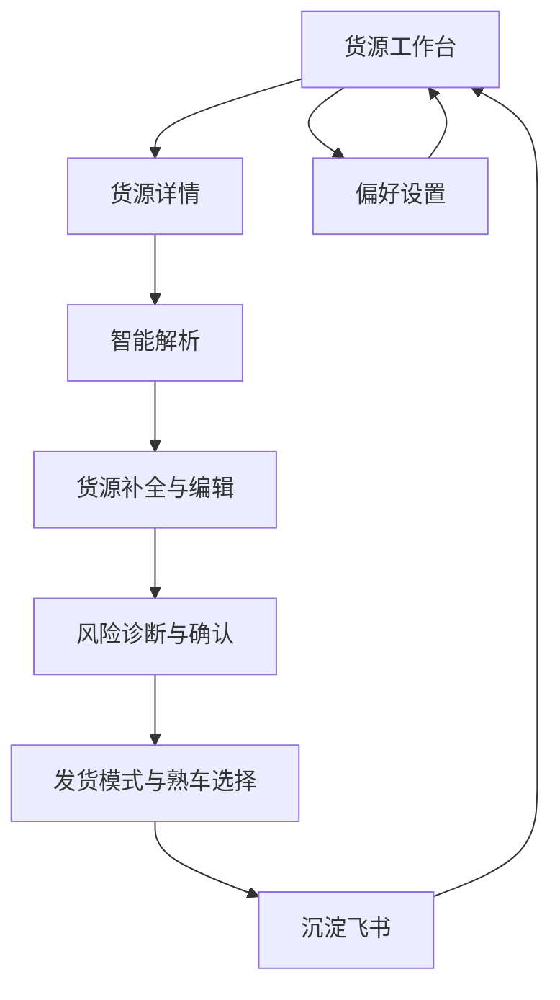

## 1. Product Overview
面向 3PL/企业直客调度的“货源沉淀工作台”，把文本/Excel/图片里的零散货源信息快速结构化、校验并沉淀到飞书多维表。
核心价值：减少人工录入与漏填风险，加速从“接单线索”到“可发货记录”的转化。

## 2. Core Features

### 2.1 User Roles
| 角色 | 注册/登录方式 | 核心权限 |
|------|--------------|----------|
| 调度/运营（默认） | 本地打开工作台；可选飞书 OAuth 连接 | 新建/编辑货源；批量解析与补全；选择发货模式与熟车；沉淀到飞书；飞书同步 |
| 管理员（可选） | 同上 | 配置字段映射/发货偏好/运力池；处理异常与校验规则调整 |

### 2.2 Feature Module
我们的需求由以下页面构成：
1. **货源工作台**：统一输入（文本/Excel/图片）、货源列表、批量操作（解析/补全/沉淀）、飞书连接与同步。
2. **货源详情（含流程步骤）**：智能解析、补全与字段编辑、风险诊断与确认、发货模式选择与熟车推荐、沉淀结果。
3. **偏好设置**：平台字段映射、发货偏好参数、我的运力池维护、飞书字段映射。

### 2.3 Page Details
| Page Name | Module Name | Feature description |
|---|---|---|
| 货源工作台 | 统一输入 | 接收文本/Excel/CSV/图片粘贴或拖拽；按“每行一票”拆分；生成货源草稿 |
| 货源工作台 | 货源列表 | 展示每票关键摘要（路线/货类/车型/价格）；显示阶段与阻断状态；进入详情/下一步 |
| 货源工作台 | 批量处理 | 批量解析、批量补全、批量沉淀飞书；展示总体进度（总票数/处理中/已沉淀） |
| 货源工作台 | 飞书连接与同步 | OAuth 连接/重新授权；显示连接状态；支持“飞书→Web 覆盖”“Web→飞书 覆盖”“增量同步” |
| 货源详情 | 步骤导航 | 以 Stepper 呈现 4 阶段：智能解析→货源补全→发货模式→已沉淀飞书；允许在未发布/未沉淀时回退步骤 |
| 货源详情 | 智能解析 | 展示原始文本；一键解析为本地字段+置信度；列出未识别字段 |
| 货源详情 | 智能补全与编辑 | 基于历史/偏好/知识库补全字段；支持直接编辑；提示“必填缺失/建议补充”；单独确认运费与装货时间 |
| 货源详情 | 风险诊断与确认 | 诊断阻断风险（如地址/联系人/温度/运费/车型缺失）；展示风险清单；用户勾选“关键信息已确认”后才能进入发货模式 |
| 货源详情 | 发货模式与熟车 | 选择策略（如推送/指派/公开等）；按距离、车型车长等从运力池推荐熟车；支持多选司机；显示“可联系/发货后可见” |
| 货源详情 | 沉淀飞书 | 校验字段映射与平台必填；将记录写入/更新到飞书多维表；展示沉淀结果与关联 ID |
| 偏好设置 | 字段映射 | 配置本地字段→平台字段的映射与转换规则（如去“米”、时间格式、付款方式归一） |
| 偏好设置 | 发货偏好 | 配置默认付款方式/发票类型、去重策略、价格风险阈值等 |
| 偏好设置 | 我的运力池 | 维护司机/车辆档案与标签；作为熟车推荐与筛选来源 |
| 偏好设置 | 飞书映射 | 配置 Web 字段与飞书多维表字段的映射；支持初始化缺失字段 |

## 3. Core Process
你在工作台粘贴/导入多票货源信息后，系统按行生成草稿并进入“智能解析”。你可以批量解析与补全，随后进入单票详情：核对并补齐必填（尤其运费、装货时间、地址、联系人、车型等），运行风险诊断；当无阻断项且你已确认关键信息后，选择发货模式并挑选推荐熟车，最后一键沉淀到飞书多维表用于团队协作与追踪。

