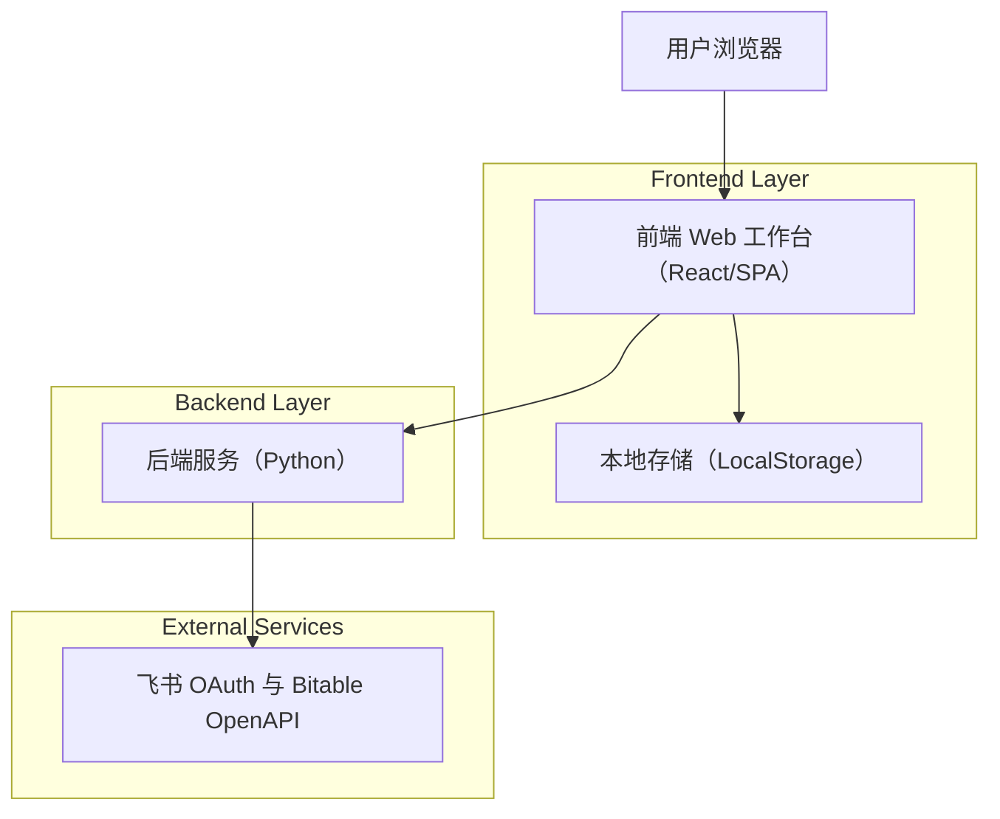
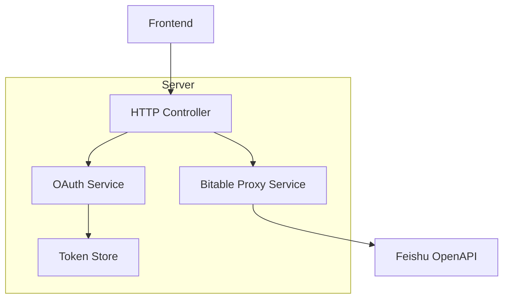
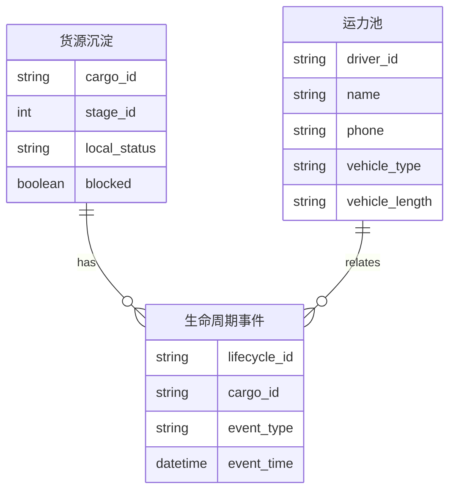

## 1.Architecture design


## 2.Technology Description
- Frontend: React@18 + vite + tailwindcss（或保持当前 HTML/CSS/JS 亦可）
- Backend: Python（轻量 HTTP 服务；负责 OAuth、token 刷新、Bitable API 代理与字段初始化）
- Database: None（业务沉淀以飞书多维表为主；偏好设置在浏览器 LocalStorage；token 在服务端本地文件/安全存储）

## 3.Route definitions
| Route | Purpose |
|---|---|
| / | 货源工作台：统一输入、列表、批量处理、飞书连接与同步 |
| /detail/:id | 货源详情：解析→补全→诊断→发货模式→沉淀 |
| /prefs | 偏好设置：字段映射、发货偏好、运力池、飞书映射 |

## 4.API definitions
### 4.1 Core API
飞书授权与状态
- `GET /auth/feishu/login`
- `GET /auth/feishu/callback`
- `GET /api/feishu/status`
- `POST /api/feishu/logout`

飞书多维表（Bitable）
- `GET /api/bitable/fields?app_token=...&table_id=...`
- `POST /api/bitable/fields/init?app_token=...&table_id=...`
- `POST /api/bitable/records/search?app_token=...&table_id=...`
- `POST /api/bitable/records/batch_create?app_token=...&table_id=...`
- `POST /api/bitable/records/batch_update?app_token=...&table_id=...`
- `POST /api/bitable/records/batch_delete?app_token=...&table_id=...`

通用 TypeScript 类型（前后端共享）
```ts
export type StageId = 1 | 2 | 3 | 4;

export type LocalStatus =
  | "draft"
  | "pending_review"
  | "ready"
  | "sunk_feishu"
  | "on_shelf"
  | "dealt"
  | "in_transit"
  | "completed";

export type Shipment = {
  id: string;
  feishu_record_id?: string | null;
  raw_text: string;
  stage_id: StageId;
  local_status: LocalStatus;
  blocked: boolean;
  created_at: number;
  updated_at: number;
  confirm: { price: boolean; load_time: boolean };
  s5_confirmed: boolean;
  platform: { cargo_id: string; order_id: string; driver_id: string; status: string };
};

export type RiskItem = { rule_id: string; level: "red"|"yellow"|"blue"; field: string; message: string; action: string };
export type RiskResult = { can_publish: boolean; summary: string; risks: RiskItem[] };
```

## 5.Server architecture diagram


## 6.Data model(if applicable)
### 6.1 Data model definition
业务数据以飞书多维表为主（至少 1 张“货源沉淀表”，可选“运力池表/生命周期表”）。



### 6.2 Data Definition Language
不使用自建数据库；表结构由飞书多维表字段设计文档定义。