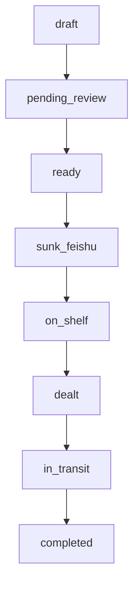

## 1. 设计目标
将工作台中的“货源”以可协作、可筛选、可追踪的结构沉淀到飞书多维表；并用清晰的状态流转与校验规则，保证团队只处理“可发货/可跟进”的高质量记录。

## 2. 表结构（建议）
- 表 1：**货源沉淀（核心）**（必需）
- 表 2：**生命周期事件**（可选，用于平台回传/人工跟踪）
- 表 3：**运力池（熟车）**（可选，若希望在飞书侧维护司机资产）

> 若你只想最小化落地：先只建“货源沉淀”一张表即可。

## 3. 表 1：货源沉淀（字段定义）
字段命名建议与当前工作台的飞书初始化字段保持一致（便于自动建字段与同步）。

| 字段名（飞书） | 字段 code（建议） | 类型 | 必填 | 说明/来源 |
|---|---|---|---|---|
| 货源ID | cargo_id | 文本 | 是 | 本地生成唯一 ID |
| 原始输入 | raw_text | 多行文本 | 是 | 粘贴/导入的原始文本片段 |
| 阶段 | stage_id | 数字/单选 | 是 | 1解析 2补全 3发货模式 4已沉淀 |
| 本地状态 | local_status | 单选 | 是 | 见“状态流转” |
| 是否阻断 | blocked | 勾选 | 是 | 风险诊断阻断（red）即为 true |
| 创建时间 | created_at | 日期时间 | 是 | 工作台创建时间 |
| 更新时间 | updated_at | 日期时间 | 是 | 工作台更新时间 |
| 装货城市 | origin_city | 文本 | 否 | A02_origin_city（可用于筛选） |
| 卸货城市 | destination_city | 文本 | 否 | A06_destination_city |
| 货类 | goods_category | 文本 | 否 | B01+B02 的拼接展示 |
| 车型 | vehicle_type | 单选/文本 | 否 | C01_vehicle_type |
| 车长 | vehicle_length | 单选/文本 | 否 | C02_vehicle_length |
| 装货时间 | load_time | 日期时间 | 否 | D01_load_time_start |
| 温度要求 | temp_requirement | 文本 | 否 | B06_temperature_requirement |
| 对客报价（元） | client_quoted_price | 数字 | 否 | Z01_client_quoted_price |
| 平台上架价（元） | platform_shelf_price | 数字 | 否 | Z02_platform_shelf_price |
| 司机成交价（元） | driver_deal_price | 数字 | 否 | Z03_driver_deal_price |
| 毛利（元） | margin_amount | 数字 | 否 | Z04_margin_amount |
| 平台货源ID | platform_cargo_id | 文本 | 否 | 平台回填 |
| 平台订单ID | platform_order_id | 文本 | 否 | 平台回填 |
| 平台司机ID | platform_driver_id | 文本 | 否 | 平台回填 |
| 平台状态 | platform_status | 单选/文本 | 否 | 平台回填（如上架/成交/在途/完结） |

### 3.1 业务扩展字段（强烈建议补充，便于校验与协作）
| 字段名（飞书） | code（建议） | 类型 | 必填 | 说明 |
|---|---|---|---|---|
| 装货详细地址 | origin_addr_detail | 多行文本 | 是（沉淀前） | A04_origin_address_detail |
| 卸货详细地址 | dest_addr_detail | 多行文本 | 是（沉淀前） | A08_destination_address_detail |
| 装货联系人 | origin_contact_name | 文本 | 是（沉淀前） | F01_origin_contact_name |
| 装货电话 | origin_contact_phone | 文本 | 是（沉淀前） | F02_origin_contact_phone |
| 卸货联系人 | dest_contact_name | 文本 | 是（沉淀前） | F03_destination_contact_name |
| 卸货电话 | dest_contact_phone | 文本 | 是（沉淀前） | F04_destination_contact_phone |
| 货重(吨) | goods_weight_ton | 数字 | 是（沉淀前） | B03_goods_weight_ton（平台草稿必填） |
| 方量(方) | goods_volume_m3 | 数字 | 否 | B04_goods_volume_m3 |
| 运费（元） | freight_price | 数字 | 是（沉淀前） | E01_freight_price（风险诊断必填） |
| 付款方式 | pay_method | 单选 | 是（沉淀前） | E03_payment_method（到付/月结等） |
| 发货策略 | dispatch_strategy | 单选 | 否 | push/assign/open（与工作台策略一致） |
| 已确认关键信息 | confirmed | 勾选 | 是（沉淀前） | 对应工作台“我已确认…” |

## 4. 状态流转（建议统一口径）
### 4.1 local_status 枚举
- draft：草稿（刚导入/未解析）
- pending_review：已补全待核对（字段可编辑、需确认运费/装货时间）
- ready：可沉淀（通过风险诊断且已确认）
- sunk_feishu：已沉淀飞书
- on_shelf / dealt / in_transit / completed：平台链路状态（若接入平台回填）

### 4.2 流转规则
- draft → pending_review：完成解析并生成补全结果
- pending_review → ready：满足“沉淀前校验”且 confirmed=true 且 blocked=false
- ready → sunk_feishu：成功写入飞书记录（创建或更新）
- sunk_feishu → on_shelf/dealt/in_transit/completed：平台侧回填或人工维护

## 5. 校验规则（沉淀前必须通过）
这些规则与工作台的风险诊断/映射校验保持一致，用于保证“可发货记录”的质量：

### 5.1 必填完整性（缺失即阻断）
- origin_addr_detail、dest_addr_detail：不能为空（建议长度≥6）
- origin_contact_name、dest_contact_name：不能为空
- origin_contact_phone、dest_contact_phone：必须为手机号格式（建议正则：^1\d{10}$）
- vehicle_type、vehicle_length：不能为空
- load_time：不能为空
- freight_price：必须 > 0
- goods_weight_ton：必须 > 0（平台草稿必填；否则不允许沉淀）
- confirmed：必须为 true

### 5.2 条件必填（缺失即阻断）
- 当 goods_category 包含“冻品/医药”（或一级货类为“冻品/医药”）时：temp_requirement 必填

### 5.3 预警（不阻断，但需提示）
- goods_weight_ton 缺失（若你决定不设为必填时）：提示“建议补充”
- freight_price 低于市场 P25：黄色预警
- freight_price 高于市场 P75：信息提示

## 6. 飞书侧实现建议（字段类型/配置）
- stage_id、local_status、platform_status、pay_method、dispatch_strategy：用「单选」便于筛选与看板
- blocked、confirmed：用「勾选」
- created_at、updated_at、load_time：用「日期时间」
- 价格/吨位/方量：用「数字」
- 电话：用「文本」并配合自动化/脚本校验（多维表本身不强制正则时）

> 你后续若要与工作台自动建字段对齐：优先保证表 1 至少包含 cargo_id/raw_text/stage_id/local_status/blocked/created_at/updated_at 等初始化字段。